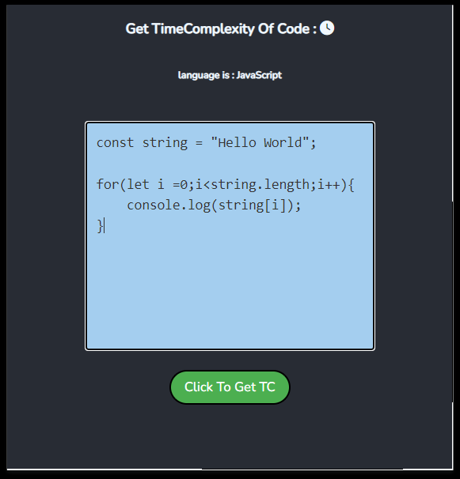
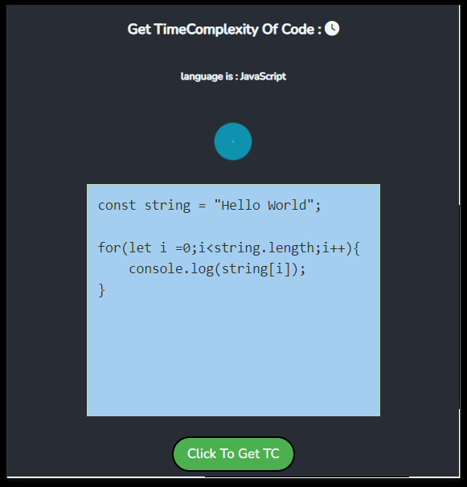
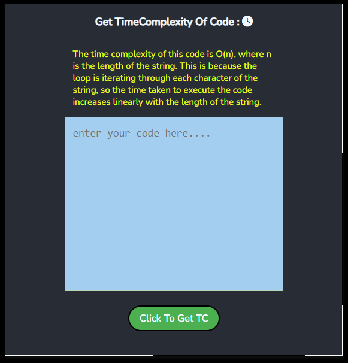

<body>
<h2>Get Code TimeComplexity</h2>
<h4>Step's to run </h4>
<ol>
<li>npm install</li>
<li>npm start</li>
</ol>
<h4>To add chrome extension</h4>
<ol>
<li>npm run build</li>
<li>add this build to your chrome extension</li>
</ol>
<h4>DEMO</h4>

<body>
